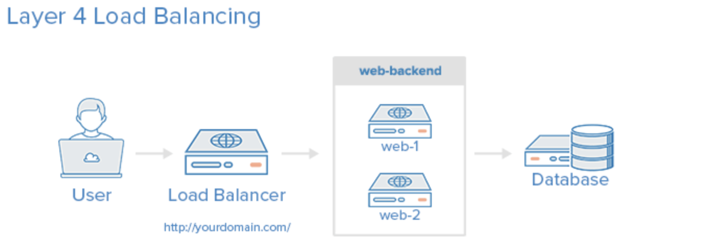

# Load Balancing

## 이해를 돕기 위한 스토리 텔링

> 찬형은 더 이상 구닥다리 프로젝트를 포트폴리오로 내고 싶지 않았다. 그래서 간단하지만 재밌는 할로윈 특집 TRICK or TREAT! 웹 서비스를 뚝딱 만들었다. 구직자의 입장에서 회사는 늘 다양한 경험을 요구하는 것 같았기 때문에 이번에는 배포를 목표로 웹 서버도 구축하고, 도메인도 사서 씌웠다. 별로 필요하진 않지만 괜히 얼마 전에 공부한 HTTPS도 적용했다. 할로윈이 다가오자 이 획기적인 서비스는 **많은 사람을 금방 끌어들였고, 단 하나의 서버로 동작하고 있던 시스템은 얼마 못 가 부하를 감당할 수 없는 상황**에 이르렀다.

### 어떤 문제가 발생했나?

- 사용자(트래픽)이 늘어 서버가 수용할 수 있는 클라이언트의 수를 넘어섰다.
  - 더 이상 데이터를 저장할 수 없게 되었다. (데이터베이스 or 저장소 상한 도달)
  - 더 이상 연산을 처리할 수 없게 되었다. (CPU 상한 도달)
  - 더 이상 요청을 받을 수 없게 되었다. (네트워크 상한 도달)

### 어떻게 대처해야 하는가?

> "서버를 늘려야겠지!"

_그런데, 사실 서버를 늘리는 방법에도 여러 가지가 있다._

### Scale-up

- 서버가 더 빠르게 동작하기 위해 하드웨어(장비) 성능을 업그레이드 하는 방법
  - 시원하게 500TB 하드 사서 끼운다.
  - CPU 코어 더 많고, 성능 좋은 걸로 업그레이드 한다.
  - 서버와 연결된 회선의 네트워크 대역폭을 어찌저찌 늘린다.

> **돈이 너무 많이 들어서** 이 방법은 포기했다.

### Scale-out

- 여러 대의 서버가 나눠서 요청을 처리하는 방법
  - 서버 한 대를 더 둔다.
  - 부족하다면 한 대를 더 둔다.
  - 부족하다면 ...

> 찬형은 마침 집에 노는 PC가 있어서 얘도 서버로 쓰면 되겠다고 생각했다. 따로 비용이 발생하지도 않는다. 혹시라도 성능이 또 부족해진다면 비슷한 스펙으로 한 대 더 사면 된다. **그게 더 싸게 치니까!**
> 그리고, 생각해보니 서버를 여러 대 두면 업데이트나 점검이 필요한 경우에도 **중단 없이 서비스를 제공**할 수 있다.
> 결국 Scale-out을 채택하게 되었다.

---

## Load Balancing

> 일단 서버를 한 대 더 만들긴 했는데... 아무것도 모르는 찬형은 새로운 서버에 붙일 도메인을 구매하기로 결정했다. 그리고 TRICK or TREAT! 서비스 상단에 공지 알림으로 새로운 도메인 주소를 공개했다. 하지만 공지사항을 잘 읽는 사람은 몇 없었기 때문에 여전히 **기존 서버에만 트래픽이 몰리는 상황**이 발생하고 만다.

### Load Balancing이란?

하나의 인터넷 서비스에 발생하는 트래픽이 많을 때 여러 대의 서버가 트래픽을 분산 처리하여 서버의 로드율 증가, 부하량, 속도저하 등을 고려하여 적절히 분산처리하도록 만드는 것

즉, <b>서버에 가해지는 부하(=로드)를 분산(=밸런싱)해주는 장치 또는 기술</b>

### Load Balancing 종류

OSI 7 Layer 대부분의 계층에서 로드 밸런싱을 처리할 수 있음. 일반적으로 L4, L7에서 주로 사용

- L4 - Transport Layer에서 로드 밸런싱
  
  - IP Address, Port, Protocol 등을 기준으로 로드 밸런싱
- L7 - Application Layer에서 로드 밸런싱
  
  - URI, HTTP Header, Cookie 등을 기준으로 로드 밸런싱

|       |                                                              L4 Load Balancer                                                              |                                                                           L7 Load Balancer                                                                            |
| :---: | :----------------------------------------------------------------------------------------------------------------------------------------: | :-------------------------------------------------------------------------------------------------------------------------------------------------------------------: |
| Layer |                                                         Transport Layer(전송 계층)                                                         |                                                                     Application Layer(응용 계층)                                                                      |
| 특징  |                                                           TCP/UDP 포트 정보 기준                                                           |                                                        TCP/UDP 정보 + HTTP URI, FTP 파일명, 쿠기 정보 등 기준                                                         |
| 장점  | - 패킷 레벨에서 로드를 분산하기 때문에 빠르고 효율적 - 데이터를 복호화할 필요 없어 비교적 안전 - L7 로드밸런서보다 가격이 저렴함 |         - 상위 계층에서 로드를 분산하기 때문에 더 섬세한 라우팅이 가능 - 캐싱 가능 비정상적인 트래픽을 사전에 필터링할 수 있어 서비스 안전성이 높음         |
| 단점  |          - 패킷의 내용을 볼 수 없어 섬세한 라우팅이 불가능 - 사용자의 IP가 자주 변경되는 경우 연속적인 서비스 제공이 어려움           | - 패킷의 내용을 복호화하기 위한 비용 발생 - 클라이언트가 로드밸런서와 인증서를 공유해야 하기 때문에 공격자가 로드밸런서를 통해 데이터에 접근할 수 있는 위협 존재 |

### Load Balancing Algorithm

- Round Robin (라운드 로빈)
  - 서버에 들어온 요청을 순서대로 돌아가며 배정
  - 여러 대의 서버가 동일한 스펙을 갖고 있는 경우 적합
  - 서버와의 연결(세션)이 오래 지속되지 않는 경우 적합
- Weighted Round Robin (가중 라운드 로빈)
  - 서버마다 가중치를 책정하고 가중치가 높은 서버에 클라이언트를 우선 배분
  - 트래픽 처리 능력이 상이한 경우 사용
- IP Hash (IP 해시)
  - 해시 값을 각 서버에 매핑
  - 클라이언트 IP 주소를 해싱해 로드를 분배
- Least Connection (최소 연결)
  - 요청이 들어온 시점에 연결 수가 가장 적은 서버로 트래픽 전송
  - 세션이 일반적으로 길게 유지되는 서비스 등 분배된 트래픽이 균일하지 않은 경우 적합
- Least Response Time (최소 응답 시간)
  - 서버의 연결 수와 응답 시간을 모두 고려해 트래픽 배분

### Load Balancer의 장애 대비

- Load Balancer를 이중화
  
  - 이중화된 Load Balancer는 서로 Health Check
  - Main Load Balancer가 동작하지 않으면 나머지 Load Balancer로 가상 IP 변경
  - 여분의 Load Balancer로 운영

## 출처

- https://choibulldog.tistory.com/61 (성능 테스트)
- https://scshim.tistory.com/442 (성능 테스트)
- https://nesoy.github.io/articles/2018-06/Load-Balancer (로드 밸런서)
- https://m.post.naver.com/viewer/postView.naver?volumeNo=27046347&memberNo=2521903 (로드 밸런싱)
